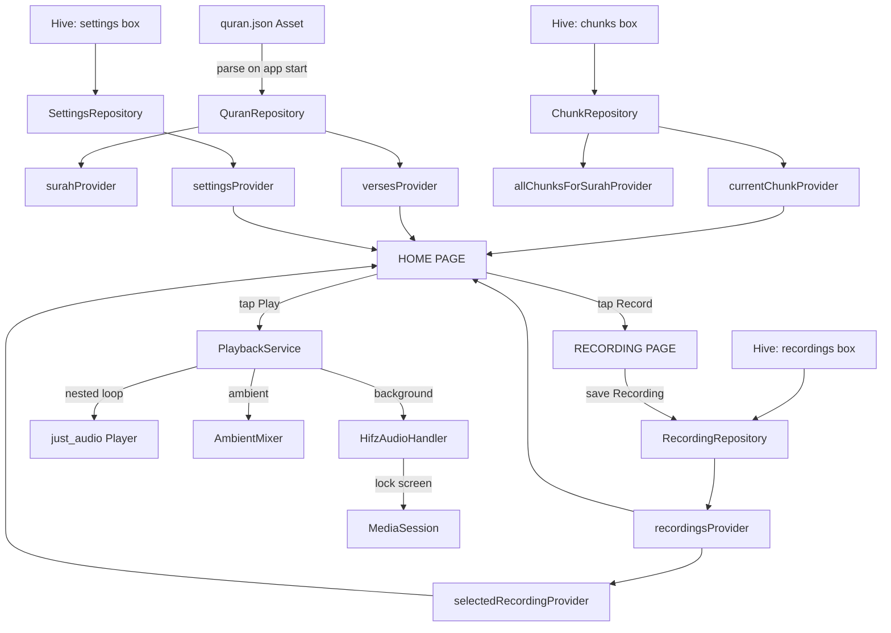
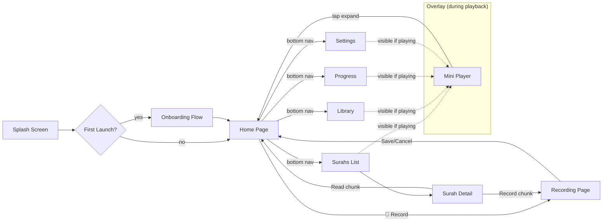

# 01 — ARCHITECTURE & TECH STACK

## 🛠️ Technology Stack

```yaml
Framework:        Flutter (Dart) — SDK >=3.0.0 <4.0.0, Flutter >=3.16.0
State Management: flutter_riverpod ^2.4.9 + riverpod_annotation ^2.3.3
Navigation:       go_router ^13.0.0
Local Storage:    hive ^2.2.3 + hive_flutter ^1.1.0
Audio Recording:  record ^5.0.4
Audio Playback:   just_audio ^0.9.36
Background Audio: audio_service ^0.18.12
UI/Fonts:         google_fonts ^6.1.0 (Amiri for Arabic, Poppins, Inter)
Animations:       flutter_animate ^4.3.0
Icons:            lucide_icons ^0.257.0
Data Models:      freezed ^2.4.6 + freezed_annotation ^2.4.1
Serialization:    json_serializable ^6.7.1 + json_annotation ^4.8.1
Utilities:        uuid ^4.3.1, intl ^0.19.0, collection ^1.18.0, path_provider ^2.1.2
Code Gen:         build_runner ^2.4.8, riverpod_generator ^2.3.9, hive_generator ^2.0.1
```

---

## 📦 pubspec.yaml

```yaml
name: hifz_companion
description: Quran Memorization App — Passive Listening Hifz

environment:
  sdk: '>=3.0.0 <4.0.0'
  flutter: '>=3.16.0'

dependencies:
  flutter:
    sdk: flutter
  flutter_riverpod: ^2.4.9
  riverpod_annotation: ^2.3.3
  go_router: ^13.0.0
  hive: ^2.2.3
  hive_flutter: ^1.1.0
  path_provider: ^2.1.2
  just_audio: ^0.9.36
  audio_service: ^0.18.12
  record: ^5.0.4
  google_fonts: ^6.1.0
  lucide_icons: ^0.257.0
  flutter_animate: ^4.3.0
  freezed_annotation: ^2.4.1
  json_annotation: ^4.8.1
  uuid: ^4.3.1
  intl: ^0.19.0
  collection: ^1.18.0

dev_dependencies:
  flutter_test:
    sdk: flutter
  flutter_lints: ^3.0.1
  build_runner: ^2.4.8
  freezed: ^2.4.6
  json_serializable: ^6.7.1
  riverpod_generator: ^2.3.9
  hive_generator: ^2.0.1

flutter:
  uses-material-design: true
  assets:
    - assets/data/quran.json
    - assets/fonts/
    - assets/audio/ambient/
  fonts:
    - family: AmiriQuran
      fonts:
        - asset: assets/fonts/AmiriQuran-Regular.ttf
```

---

## 📂 Folder Structure

```
lib/
├── main.dart                          // App entry point, Hive init, ProviderScope
├── app/
│   ├── router.dart                    // GoRouter config with ShellRoute
│   ├── theme.dart                     // ThemeData, AppColors, AppTextStyles
│   └── shell.dart                     // MainShell — bottom nav + mini player
│
├── features/
│   ├── home/
│   │   ├── home_page.dart             // Main widget — assembles 5 zones
│   │   ├── widgets/
│   │   │   ├── header_bar.dart        // Zone 1 — chunk nav + dots
│   │   │   ├── surah_selector.dart    // Zone 2 — quick-select chip
│   │   │   ├── verse_scroller.dart    // Zone 3 — PageView + zoom
│   │   │   ├── verse_card.dart        // Individual verse card
│   │   │   ├── playback_status_bar.dart // Zone 4 — seek + counters
│   │   │   ├── control_bar.dart       // Zone 5 — Record + Play + menu
│   │   │   ├── recording_selector_sheet.dart
│   │   │   ├── playback_settings_sheet.dart
│   │   │   └── surah_picker_modal.dart
│   │   └── providers/
│   │       ├── home_providers.dart
│   │       └── playback_state.dart
│   │
│   ├── recording/
│   │   ├── record_page.dart           // Full-screen recording activity
│   │   ├── widgets/
│   │   │   ├── recording_header_bar.dart
│   │   │   ├── progress_track.dart
│   │   │   ├── verse_display.dart
│   │   │   ├── waveform_visualizer.dart
│   │   │   ├── recording_action_area.dart
│   │   │   ├── save_dialog.dart
│   │   │   └── cancel_confirmation.dart
│   │   └── providers/
│   │       └── recording_state.dart
│   │
│   ├── surahs/
│   │   ├── surahs_list_page.dart
│   │   ├── surah_detail_page.dart
│   │   └── widgets/
│   │       ├── surah_card.dart
│   │       ├── chunk_card.dart
│   │       └── regenerate_dialog.dart
│   │
│   ├── library/
│   │   ├── library_page.dart
│   │   └── widgets/
│   │       ├── recording_list_item.dart
│   │       ├── bookmark_card.dart
│   │       └── collection_card.dart   // placeholder for v2
│   │
│   ├── progress/
│   │   ├── progress_page.dart
│   │   └── widgets/
│   │       ├── progress_ring.dart
│   │       ├── stats_card.dart
│   │       ├── weekly_heatmap.dart
│   │       ├── surah_grid.dart
│   │       ├── activity_timeline.dart
│   │       ├── goals_section.dart
│   │       └── prediction_engine.dart
│   │
│   ├── settings/
│   │   ├── settings_page.dart
│   │   └── widgets/
│   │       ├── setting_stepper.dart
│   │       ├── setting_dropdown.dart
│   │       └── setting_switch.dart
│   │
│   ├── onboarding/
│   │   ├── onboarding_flow.dart
│   │   └── widgets/
│   │       └── onboarding_page.dart
│   │
│   └── splash/
│       └── splash_screen.dart
│
├── core/
│   ├── audio/
│   │   ├── playback_service.dart      // Nested repetition loop engine
│   │   ├── audio_handler.dart         // HifzAudioHandler (BaseAudioHandler)
│   │   ├── recording_service.dart     // Mic recording wrapper
│   │   └── ambient_mixer.dart         // Ambient audio layer
│   │
│   ├── data/
│   │   ├── models/
│   │   │   ├── surah.dart             // @freezed Surah
│   │   │   ├── verse.dart             // @freezed Verse
│   │   │   ├── chunk.dart             // @freezed Chunk (Hive adapter)
│   │   │   ├── recording.dart         // @freezed Recording (Hive adapter)
│   │   │   ├── verse_audio.dart       // @freezed VerseAudio
│   │   │   ├── user_settings.dart     // @freezed UserSettings (Hive adapter)
│   │   │   ├── playback_state.dart    // PlaybackState enum + data
│   │   │   ├── bookmark.dart          // @freezed Bookmark (Hive adapter)
│   │   │   └── activity_log.dart      // @freezed ActivityLog (Hive adapter)
│   │   │
│   │   ├── repositories/
│   │   │   ├── quran_repository.dart  // JSON asset → Surah/Verse objects
│   │   │   ├── chunk_repository.dart  // CRUD chunks (Hive)
│   │   │   ├── recording_repository.dart // CRUD recordings (Hive)
│   │   │   ├── settings_repository.dart  // Read/write settings (Hive)
│   │   │   ├── bookmark_repository.dart  // CRUD bookmarks (Hive)
│   │   │   └── activity_repository.dart  // Log playback/recording sessions
│   │   │
│   │   └── quran_data_loader.dart     // Load + parse quran.json
│   │
│   ├── providers/
│   │   ├── quran_providers.dart       // currentSurahProvider, versesProvider
│   │   ├── chunk_providers.dart       // currentChunkProvider, allChunksProvider
│   │   ├── recording_providers.dart   // recordingsProvider, selectedRecordingProvider
│   │   ├── settings_providers.dart    // settingsProvider
│   │   └── playback_providers.dart    // playbackStateProvider
│   │
│   └── utils/
│       ├── chunk_generator.dart       // Auto-chunk algorithm (size + overlap)
│       ├── constants.dart             // TOTAL_QURAN_VERSES = 6236, etc.
│       ├── date_utils.dart            // timeAgo, formatDuration
│       └── file_utils.dart            // Delete files, orphan cleanup
│
└── assets/
    ├── data/quran.json                // Full Quran data (see 02_DATA_MODELS.md)
    ├── fonts/AmiriQuran-Regular.ttf
    └── audio/ambient/
        ├── rain_light.mp3
        ├── rain_moderate.mp3
        ├── nature_forest.mp3
        ├── ocean_waves.mp3
        ├── white_noise.mp3
        └── night_crickets.mp3
```

---

## 🏗️ Architecture Pattern

```
┌─────────────────────────────────────────────────────┐
│                    PRESENTATION                      │
│  Pages (StatefulWidget / ConsumerStatefulWidget)     │
│  Widgets (StatelessWidget / ConsumerWidget)          │
│  Bottom Sheets / Dialogs                             │
└────────────────────┬────────────────────────────────┘
                     │ ref.watch() / ref.read()
┌────────────────────▼────────────────────────────────┐
│                    STATE MANAGEMENT                   │
│  Riverpod Providers (StateNotifier, FutureProvider,  │
│  StreamProvider, Provider)                            │
│  PlaybackStateNotifier (finite state machine)        │
└────────────────────┬────────────────────────────────┘
                     │
┌────────────────────▼────────────────────────────────┐
│                    DOMAIN / SERVICES                  │
│  PlaybackService (nested repetition loop)            │
│  RecordingService (mic wrapper)                      │
│  AmbientMixer (secondary audio player)               │
│  ChunkGenerator (auto-chunk algorithm)               │
└────────────────────┬────────────────────────────────┘
                     │
┌────────────────────▼────────────────────────────────┐
│                    DATA LAYER                         │
│  Repositories (QuranRepo, ChunkRepo, RecordingRepo,  │
│  SettingsRepo, BookmarkRepo, ActivityRepo)            │
│  Hive Boxes (local persistence)                      │
│  JSON Asset Loader (quran.json)                      │
│  File System (audio .m4a files)                      │
└─────────────────────────────────────────────────────┘
```

---

## 🗄️ Hive Box Registry

| Box Name | Type Adapter | Contents |
|----------|-------------|----------|
| `chunks` | `ChunkAdapter` | All generated chunks across all surahs |
| `recordings` | `RecordingAdapter` | All recording metadata (verse file paths) |
| `settings` | `UserSettingsAdapter` | Single entry — user preferences |
| `bookmarks` | `BookmarkAdapter` | Bookmarked verses |
| `activity` | `ActivityLogAdapter` | Playback + recording session logs |
| `meta` | — (primitive) | `lastActiveChunkId`, `onboardingComplete`, `appVersion` |

---

## 🔀 Mermaid: High-Level Data Flow



---

## 🔀 Mermaid: Navigation Graph


