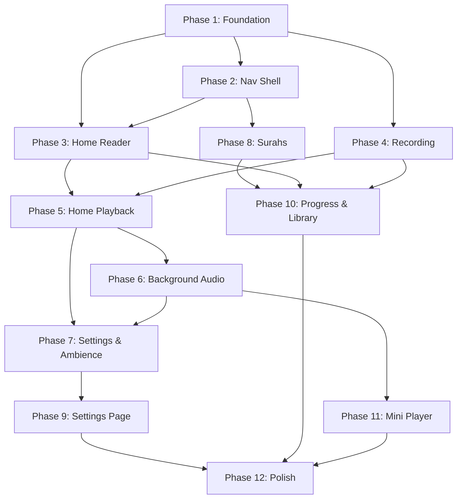

# 16 — IMPLEMENTATION PLAN

## Phased Build Order

Build in this exact sequence. Each phase depends on the previous one.

---

## PHASE 1: Foundation (Days 1–3)

```
├─→ Flutter project setup (pubspec.yaml, folder structure)
├─→ Hive initialization in main.dart
├─→ All Freezed models (Surah, Verse, Chunk, Recording, VerseAudio, UserSettings, Bookmark, ActivityLog)
├─→ Run build_runner to generate .freezed.dart and .g.dart files
├─→ Hive type adapters registration
├─→ QuranDataLoader: parse quran.json asset → List<Surah>
├─→ All repositories (QuranRepo, ChunkRepo, RecordingRepo, SettingsRepo, BookmarkRepo, ActivityRepo)
├─→ ChunkGenerator algorithm (size + overlap)
├─→ All Riverpod providers (quran, chunk, recording, settings, playback state)
├─→ AppColors, AppTextStyles, ThemeData (light + dark)
└─→ Constants file (TOTAL_QURAN_VERSES = 6236, etc.)
```

**Milestone**: `flutter run` shows blank app with no errors. All models compile. Providers return data.

---

## PHASE 2: Navigation Shell (Days 3–4)

```
├─→ GoRouter configuration (all routes)
├─→ MainShell with BottomNavigationBar (5 tabs)
├─→ Route guards (onboarding redirect)
├─→ Stub pages for all 5 tabs (just AppBar + "Coming soon")
├─→ Default entry logic (lastActiveChunkId → Home)
└─→ Basic deep link handling
```

**Milestone**: Can navigate between all 5 tabs. Bottom nav highlights correctly. Routes work.

---

## PHASE 3: Home Page — Reader Mode (Days 4–7)

```
├─→ HomePage widget with 5-zone Column layout
├─→ Zone 1: Header bar (surah name, chunk arrows, dots)
├─→ Zone 2: Surah quick-selector chip
├─→ Zone 3: Verse scroller (PageView, vertical)
│     ├─→ Verse card widget (Arabic + transliteration + translation)
│     ├─→ Zoom effect (scale 1.0 current, 0.85 adjacent)
│     ├─→ Opacity transition (1.0 current, 0.4 adjacent)
│     └─→ RTL text direction for Arabic
├─→ Zone 5: Control bar (Record + Play buttons, static)
├─→ Chunk navigation (◀/▶) with slide animation (300ms)
├─→ RTL arrow inversion
├─→ Chunk dots update + scroll
├─→ Debounce on chunk navigation (300ms)
├─→ Surah picker modal (search + filter + tap-to-select)
└─→ Loading skeleton (shimmer) for Home Page
```

**Milestone**: Can browse all surahs and verses. Chunk navigation works with animations. Verse zoom effect is smooth.

---

## PHASE 4: Recording Page (Days 7–10)

```
├─→ RecordPage scaffold (full-screen, no bottom nav)
├─→ RecordingService wrapper (record package)
├─→ Microphone permission request flow
├─→ Zone 1: Header bar (✕ close + surah info + session timer)
├─→ Zone 2: Progress track (verse blocks)
├─→ Zone 3: Verse display (single verse, centered)
├─→ Zone 4: Waveform visualizer (amplitude bars + verse timer)
├─→ Zone 5: Action area (NEXT/FINISH + Redo + Preview)
├─→ Per-verse recording flow:
│     ├─→ Auto-start on page load / verse advance
│     ├─→ Stop + save on NEXT tap
│     ├─→ NEXT → FINISH morph on last verse
│     ├─→ Verse transition animation (slide, 300ms)
│     └─→ Debounce (500ms _isProcessing flag)
├─→ Redo flow (re-record current verse)
├─→ Preview flow (playback + re-record)
├─→ Save dialog (naming + summary + persist Recording entity)
├─→ Cancel confirmation dialog
├─→ File cleanup on discard
└─→ Navigate back to Home with auto-select new recording
```

**Milestone**: Can record a complete chunk (7 verses). Each verse saved as separate .m4a. Recording appears in Home Page recording selector.

---

## PHASE 5: Home Page — Playback Mode (Days 10–14)

```
├─→ Recording selector bottom sheet
├─→ Selected recording label in Zone 5
├─→ PlaybackService with nested repetition loop
│     ├─→ Verse repetition (inner loop)
│     ├─→ Chunk repetition (outer loop)
│     ├─→ Infinite repetition (chunkRep = 0)
│     └─→ Inter-verse gap (configurable silence)
├─→ Play/Pause/Stop state machine
├─→ Zone 4: Playback status bar (appear/disappear animation)
│     ├─→ Seek bar (drag + tap)
│     ├─→ Skip ◀◀/▶▶
│     ├─→ Repetition counters
│     └─→ Speed badge (tappable cycle)
├─→ Auto-scroll verses during playback (400ms, easeInOutCubic)
├─→ Active verse gold glow animation (2s loop)
├─→ Paused verse breathe animation (3s loop)
└─→ Play button morph animation
```

**Milestone**: Full playback loop works. Verses auto-scroll. Nested repetition counts correctly. Can pause/resume/stop/seek/skip.

---

## PHASE 6: Background Audio (Days 14–16)

```
├─→ HifzAudioHandler (extends BaseAudioHandler)
├─→ audio_service initialization in main.dart
├─→ Lock screen controls (play/pause/stop/skip)
├─→ MediaSession metadata (surah name, verse number, recording name)
├─→ Notification styling (Android MediaStyle, iOS Control Center)
├─→ Audio focus handling (duck on call, pause on headphone disconnect)
├─→ Headset reconnect auto-resume
├─→ Screen-off playback verification
└─→ AmbientMixer (secondary AudioPlayer, infinite loop, independent volume)
```

**Milestone**: Lock phone. Audio continues. Lock screen shows controls with correct metadata. Unplug headphones → pauses. Plug back → resumes.

---

## PHASE 7: Playback Settings & Ambience (Days 16–18)

```
├─→ Playback settings bottom sheet (⋮ menu)
│     ├─→ Speed control (chips + fine slider, live apply)
│     ├─→ Verse repetition selector
│     ├─→ Chunk repetition selector
│     ├─→ Inter-verse gap slider
│     ├─→ Ambience selector (chips)
│     ├─→ Ambience volume slider
│     ├─→ Auto-advance toggle
│     ├─→ Sleep timer dropdown
│     └─→ Shuffle toggle
├─→ Ambient audio integration (crossfade on change)
├─→ Sleep timer with volume fade-out (3s)
├─→ Settings persistence (all playback defaults saved to Hive)
└─→ Auto-advance to next chunk logic
```

**Milestone**: All playback settings functional. Ambience mixes with recitation. Sleep timer fades and stops. Auto-advance loads next chunk.

---

## PHASE 8: Surahs & Surah Detail (Days 18–21)

```
├─→ Surahs List Page
│     ├─→ Search bar (Arabic, English, transliteration, number)
│     ├─→ Filter chips (Meccan, Medinan, In Progress, Done, Not Started)
│     ├─→ Sort options (Mushaf, Revelation, Progress, Verse count, Recent)
│     ├─→ Surah card widget (name, metadata, progress bar, recording count)
│     ├─→ Resume FAB (visible if lastActiveChunk exists)
│     └─→ Loading shimmer
├─→ Surah Detail Page
│     ├─→ Surah header card (bismillah, metadata, progress)
│     ├─→ Auto-chunk generation on first visit
│     ├─→ Chunk card list (status, progress, action buttons)
│     ├─→ Regenerate chunks dialog + logic
│     └─→ Overflow menu (Play All, Export, Reset, Delete)
```

**Milestone**: Can browse all 114 surahs. Search and filter work. Chunks auto-generate. Can navigate to Home or Record from any chunk.

---

## PHASE 9: Settings Page (Days 21–23)

```
├─→ Settings page with collapsible sections
├─→ All settings widgets (Stepper, Dropdown, Switch, Slider)
├─→ Chunk Configuration section
├─→ Hifz Order section
├─→ Display section (languages, font, show/hide toggles)
├─→ Default Playback section
├─→ Recording section
├─→ Appearance section (theme, patterns, accent color)
├─→ Data & Storage section (export, import, clear, reset)
└─→ About section (version, credits, feedback)
```

**Milestone**: All settings persist and take effect. Theme switching works. Export/import functional.

---

## PHASE 10: Progress & Library (Days 23–26)

```
├─→ Progress Page
│     ├─→ Overview tab (ring, stats, heatmap)
│     ├─→ Surahs tab (grid of mini progress cards)
│     ├─→ History tab (activity timeline)
│     ├─→ Goals tab (daily/weekly targets, milestones, prediction engine)
│     └─→ Stats calculation formulas
├─→ Library Page
│     ├─→ Recordings tab (grouped by surah, actions: play/rename/export/delete)
│     ├─→ Bookmarks tab (verse bookmarks from double-tap)
│     └─→ Collections tab (placeholder for v2)
```

**Milestone**: Progress ring accurate. Streaks counting. Predictions calculating. Library shows all recordings with full management.

---

## PHASE 11: Onboarding & Mini Player (Days 26–28)

```
├─→ Splash screen (logo fade-in → spinner → transition)
├─→ Onboarding flow (5 screens with PageView)
│     ├─→ Welcome, How It Works, Language, Starting Point, Ready
│     └─→ Saves preferences and navigates to Home or Record
├─→ Mini Player (persistent overlay on non-Home pages)
│     ├─→ Progress bar + info + pause/stop/expand buttons
│     ├─→ Tap anywhere → navigate to Home
│     └─→ Visibility logic (playing/paused AND not on Home)
└─→ First-launch detection and redirect
```

**Milestone**: Fresh install shows onboarding. Mini player appears on Surahs page while audio plays. Tap expands to Home.

---

## PHASE 12: Polish (Days 28–32)

```
├─→ All animations verified at 60fps
├─→ Shimmer skeletons for every loading state
├─→ Empty states for every screen
├─→ Error handling for every edge case (see 13_GLOBAL_STATES_DIALOGS.md)
├─→ Haptic feedback for all interactions
├─→ Accessibility audit (Semantics, contrast, touch targets)
├─→ Dark mode verification on all screens
├─→ RTL verification on all Arabic content
├─→ Landscape mode adjustments
├─→ Performance profiling (memory, CPU, battery)
├─→ Orphan audio file cleanup logic
├─→ App icon and splash screen assets
└─→ Final testing on iOS + Android + Web
```

**Milestone**: Production-ready MVP. All screens complete. All animations smooth. All edge cases handled.

---

## DEPENDENCY GRAPH



---

## ESTIMATED TIMELINE

| Phase | Duration | Cumulative |
|-------|----------|-----------|
| Phase 1: Foundation | 3 days | Day 3 |
| Phase 2: Navigation | 1 day | Day 4 |
| Phase 3: Home Reader | 3 days | Day 7 |
| Phase 4: Recording | 3 days | Day 10 |
| Phase 5: Home Playback | 4 days | Day 14 |
| Phase 6: Background Audio | 2 days | Day 16 |
| Phase 7: Settings & Ambience | 2 days | Day 18 |
| Phase 8: Surahs & Detail | 3 days | Day 21 |
| Phase 9: Settings Page | 2 days | Day 23 |
| Phase 10: Progress & Library | 3 days | Day 26 |
| Phase 11: Onboarding & Mini Player | 2 days | Day 28 |
| Phase 12: Polish | 4 days | Day 32 |
| **Total** | **~32 working days** | |
